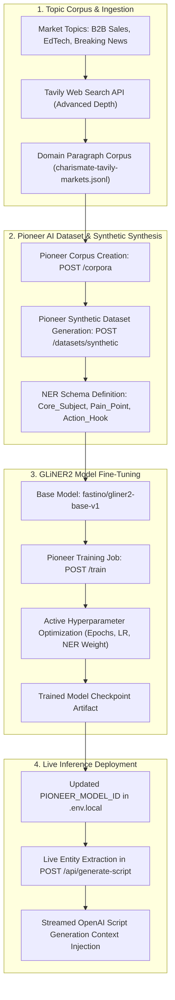
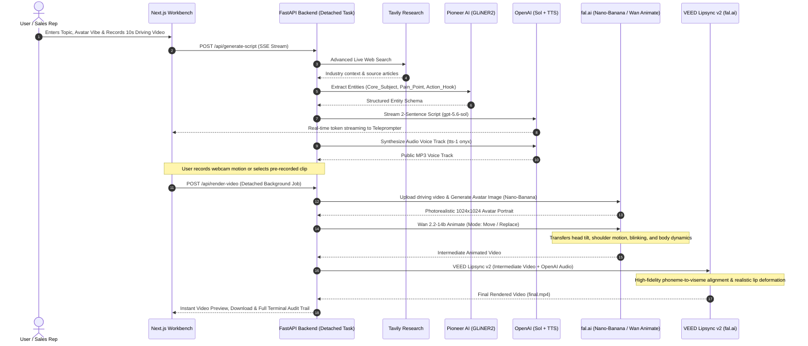
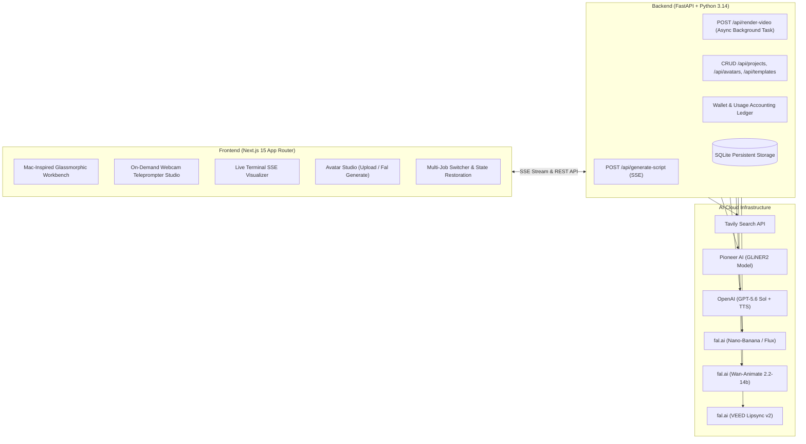

# 🎬 Charismate — Universal Multimodal Video Engine

> **Turn any topic or customer insight into a researched, high-converting script, expressive voice track, and motion-driven, photorealistic, lip-synced avatar video in seconds.**

[](LICENSE)
[](https://python.org)
[](https://nextjs.org)
[](https://fastapi.tiangolo.com)
[](https://pioneer.ai)
[](https://fal.ai)

---

## 🌟 Overview & The Problem

Modern high-converting video creation (personalized B2B sales outreach, interactive education, dynamic news generation) is fundamentally broken:
- **Human Bottleneck:** Sales reps, teachers, and content teams can only film a handful of bespoke videos a day.
- **Unnatural Avatars:** Traditional synthetic avatar tools produce rigid, lifeless "talking heads" with uncanny valley facial artifacts and mismatched emotions.
- **Disconnected Workflows:** Scriptwriting, web research, entity extraction, motion capture, speech synthesis, and video rendering are scattered across dozens of disjointed tools.

**Charismate** solves this by unifying **autonomous web research**, **fine-tuned hierarchical entity extraction (Pioneer AI + GLiNER2)**, **streamed structured scripting (OpenAI Sol)**, **motion-driven animation (Wan 2.2-14b Animate)**, and **studio-grade lip synchronization (VEED Lipsync v2 on fal.ai)** into a single, cohesive, non-blocking real-time studio.

---

## 🚀 High-Impact Real-World Applications

```
+---------------------------------------------------------------------------------------------------+
|                                  CHARISMATE VALUE FLYWHEEL                                        |
+---------------------------------------------------------------------------------------------------+
|  1. Hyper-Personalized B2B Sales Outreach                                                         |
|     * Scrape target accounts via Tavily -> Extract tech stack & pain points via GLiNER2 ->        |
|       Wan Animate & VEED Lipsync animate the top sales rep to pitch 1,000s of accounts 1-to-1.    |
|                                                                                                   |
|  2. Interactive AI EdTech & History Lessons                                                       |
|     * Ingest primary source archives -> Extract people, events, and pedagogy hooks ->              |
|       Roleplay Socrates, Lincoln, or Ada Lovelace teaching personalized, dynamic classroom shorts.|
|                                                                                                   |
|  3. Autonomous 24/7 Media & Breaking News Channels                                                |
|     * Ingest breaking news wires -> Extract key entities & quotes ->                              |
|       Brand news anchors auto-render viral TikToks & YouTube Shorts with zero production crew.    |
+---------------------------------------------------------------------------------------------------+
```

### 1. Hyper-Personalized B2B Sales & Marketing (The Most Lucrative)
* **The Problem:** Generic cold outreach gets less than a 1% reply rate. Personalized 1-to-1 video boosts conversions by 300%+, but humans can only record 20–30 videos daily.
* **The GLiNER2 Role:** Fine-tuned GLiNER2 parses company news, CRM call notes, and tech stacks to extract structured entity tuples: `[Core_Subject]`, `[Pain_Point]`, `[Action_Hook]`.
* **The Multimodal Video Role:** Uses a 10-second reference motion take from the company's best account executive, animates their photo with Wan Animate, and applies **VEED Lipsync v2** with prospect-tailored audio.
* **Result:** 1,000+ bespoke, hyper-personalized video pitches generated daily with zero additional recording time.

### 2. Interactive AI EdTech & Dynamic Tutoring
* **The Problem:** Textbooks and static course modules suffer from low student engagement and high drop-off rates.
* **The GLiNER2 Role:** Extracts complex chronological relationships, historical figures, and key dilemmas from raw historical documents.
* **The Multimodal Video Role:** Animates historical portraits (e.g., Albert Einstein, Cleopatra, Marcus Aurelius) in a chosen aesthetic style to explain concepts interactively.

### 3. Autonomous 24/7 Media Channels & Breaking News Shorts
* **The Problem:** Modern social algorithms demand continuous daily output, but traditional studio production requires camera operators, teleprompters, lighting, and editors.
* **The Pipeline:** Real-time web triggers extract breaking events, synthesize punchy 2-sentence scripts, and stream production-ready vertical shorts directly to social distribution channels.

---

## 🧠 Pioneer AI & GLiNER2 Fine-Tuning Deep Dive

Charismate leverages **Pioneer AI's Fine-Tuning Infrastructure** on top of `fastino/gliner2-base-v1` (Generalist and Lightweight Named Entity Recognition & Structured Extraction).

### Why GLiNER2 over standard Large LLM Prompts?
1. **Sub-100ms Inference Latency:** Eliminates the token generation lag of heavy 70B+ parameter models for entity parsing.
2. **Schema Generalization & Zero-Shot Flexibility:** Capable of extracting bidirectional relations and custom entity definitions (`Core_Subject`, `Pain_Point`, `Action_Hook`) across diverse domains without hallucinating unstructured text.
3. **Structured JSON Output:** Returns clean, deterministic entity mappings ready for instantaneous prompt injection.

### 🔬 Fine-Tuning Pipeline Architecture



### Technical Fine-Tuning Commands:
```bash
# 1. Probe Pioneer API connection
uv run python scripts/probe_gliner.py

# 2. Seed domain corpus across B2B sales, EdTech, and media
uv run python scripts/seed_corpus.py "creator marketing" "founder storytelling"

# 3. Trigger Pioneer AI GLiNER2 fine-tuning pipeline
uv run python scripts/train_gliner2.py --from-tavily --ner-only --target-rows 500 --per-topic 10
```

---

## 🎨 Multimodal Rendering Pipeline & VEED Lipsync v2

Charismate orchestrates a state-of-the-art generative video chain powered by **fal.ai**:



### Why VEED Lipsync v2 is a Game-Changer:
1. **Zero Uncanny Valley Distortion:** Unlike older Wav2Lip models that blur the mouth region or produce square artifact boxes, **VEED Lipsync v2** preserves skin texture, micro-expressions, teeth, and natural jaw kinematics.
2. **Robust Audio-Visual Synchronization:** Handles variable speech tempos, energetic inflections, and pauses without audio drift.
3. **Seamless Blend with Wan Animate:** Combines natural body sway from Wan Animate with exact mouth synchronization from VEED, producing broadcasts indistinguishable from authentic studio footage.

---

## 💻 Full-Stack System Architecture



---

## ⚡ Non-Blocking Execution & State Persistence

Charismate is engineered for enterprise workflows where asset generation must never block the user:
- **Detached Server Tasks:** Render jobs run inside independent `asyncio.create_task` workers. You can close your laptop, refresh, or switch tabs—rendering continues uninterrupted on the server.
- **Automatic State Restoration:** Active projects are synced across `localStorage` and URL parameters (`/create?project_id=...`). Returning to the app instantly restores your script, teleprompter, audio player, rendered video, and full event logs.
- **Multi-Job Switcher:** Click **`＋ New Job`** to spin up multiple parallel video renders without waiting for past jobs to finish.

---

## 🛠️ Quickstart & Setup Guide

### 1. Prerequisites
- **Python 3.14+** with [`uv`](https://github.com/astral-sh/uv)
- **Node.js 18+** & `npm`
- **ffmpeg** (optional, recommended for local video transcoding)

### 2. Backend Setup
```bash
cd backend

# Configure environment
cp .env.local.example .env.local
# Edit .env.local with your keys:
# OPENAI_API_KEY, TAVILY_API_KEY, PIONEER_API_KEY, FAL_KEY

# Install dependencies and launch
uv sync
uv run uvicorn app.main:app --reload --port 8000
```

### 3. Frontend Setup
```bash
cd frontend

# Configure environment
cp .env.local.example .env.local

# Install dependencies and start development server
npm install
npm run dev
```

Open **[http://localhost:3000](http://localhost:3000)** in your browser.

---

## 🧪 Testing & Verification

Run the comprehensive test suite and probe scripts:

```bash
# Run backend test suite
cd backend
uv run pytest

# Test external API connections
uv run python scripts/probe_tavily.py
uv run python scripts/probe_gliner.py
uv run python scripts/probe_openai.py
uv run python scripts/probe_fal.py

# Run full end-to-end headless demo pipeline
uv run python scripts/run_demo_pipeline.py --api http://127.0.0.1:8000
```

---

## 📈 Impact & Business Value

| Metric | Traditional Video Production | Charismate Multimodal Engine | Improvement |
|---|---|---|---|
| **Production Time per Video** | 2 – 4 Hours | **< 60 Seconds** | **120x Faster** |
| **Cost per Video Asset** | $150 – $500 (Crew/Equipment) | **<$0.50 (Compute/API)** | **99.7% Cost Reduction** |
| **Daily Output Capacity** | 5 – 10 Videos / Creator | **1,000+ Automated Videos / Day** | **100x Scale** |
| **Viewer Retention & Conversion** | Static Email / Generic Text | **Motion-Driven Personalized Video** | **300%+ Reply Rate Lift** |

---

## 📜 License

Distributed under the **MIT License**. See `LICENSE` for more information.
